  
  

<!--
- 👋 Hi, I’m @wiidede
- 👀 I’m interested in `vue` `python`
- 🌱 I’m currently learning `vue`
- 💞️ I’m looking to collaborate on Suzhou China
- 📫 E-mail: wiixdede@gmail.com coolapk: [@DD王](https://www.coolapk.com/u/641913)
- 🌏 My homePage: [wiidede.github.io](https://wiidede.github.io/)
-->

<!-- div style="display: flex;  align-items: center; justify-content: space-around;">
	
	

